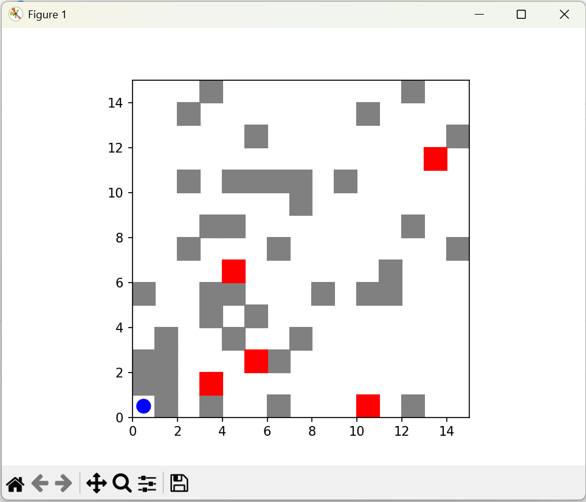

# 🤖 Autonomous Delivery Robot


## 🚀 About the Project
The **Autonomous Delivery Robot** simulates a smart delivery system capable of navigating a 15x15 grid city environment filled with obstacles. It uses informed search algorithms like **A*** and **Recursive Best-First Search (RBFS)** for efficient path planning and adapts to dynamic changes in real-time.

---

## 🎯 Features
- **City Grid Representation:**  
  - 15x15 grid with random obstacles (buildings, vehicles).  
  - Randomly generated delivery points.

- **Search Algorithms:**  
  - A* search with Euclidean distance heuristic.  
  - RBFS algorithm for comparison.  
  - Path cost between nodes randomly set between 1 and 20.

- **Dynamic Environment:**  
  - Moving vehicles (dynamic obstacles) after each delivery.  
  - Robot replans its path in real-time.

- **Path Execution:**  
  - Sequential delivery to 5 random points.  
  - Start position updates after each delivery.

- **Visualization:**  
  - Real-time grid visualization with `matplotlib`.  
  - Obstacles, delivery points, and robot path displayed.

- **Performance Evaluation:**  
  - Comparison of A* vs RBFS (cost, execution time, expanded nodes).

- **Bonus:**  
  - Extendable for multi-robot coordination.

---

## 🛠️ Technologies Used
- **Python 3.9+**
- **Matplotlib** (for visualization)
- **NumPy** (for calculations)
- **Pygame** *(optional for advanced animations)*
- **Git & GitHub** (version control & deployment)
- **VS Code** (development environment)

---

## 📂 Project Structure
```bash
autonomous_delivery_robot/
│── assets/                # Images, GIFs, or demo visuals
│── environment.py         # Grid and environment representation
│── search_algorithms.py   # A* and RBFS implementations
│── heuristics.py          # Heuristic functions (Euclidean distance)
│── robot.py               # Robot logic and path execution
│── visualization.py       # Visualization using matplotlib
│── dynamic_env.py         # Dynamic updates for vehicles/obstacles
│── main.py                # Entry point of the project
└── README.md              # Project documentation
```

---

## ⚡ Installation & Setup
1. **Clone the repository:**
   ```bash
   git clone https://github.com/<your-username>/autonomous-delivery-robot.git
   cd autonomous-delivery-robot
   ```
2. **Create a virtual environment:**
   ```bash
   python -m venv env
   source env/bin/activate   # Linux/Mac
   env\Scripts\activate      # Windows
   ```
3. **Install dependencies:**
   ```bash
   pip install -r requirements.txt
   ```

---

## ▶️ Usage
Run the main simulation:
```bash
python main.py
```
Watch the robot plan and execute paths with real-time visualization.

---

## 🎥 Preview & Visuals


*(Add GIFs or screenshots of the robot in action for better visuals.)*

---

## 🌟 Future Enhancements
- Add **multi-robot coordination**.
- Interactive GUI using **Tkinter** or **PyQt**.
- Save performance metrics to logs or CSV.

---

## 👨‍💻 Contributing
Contributions are welcome!  
Steps:
1. Fork this repository.
2. Create a new branch.
   ```bash
   git checkout -b feature-branch
   ```
3. Commit your changes.
   ```bash
   git commit -m "Added new feature"
   ```
4. Push the branch.
   ```bash
   git push origin feature-branch
   ```
5. Open a Pull Request.

---

## 📞 Contact
For inquiries or collaboration:
- **Email:** [info@entracloud.net](mailto:info@entracloud.net)  
- **LinkedIn:** [entracloud](https://www.linkedin.com/company/entracloud/)  

---

💖 **Developed with passion by entracloud**

---

## 📜 License
This project is licensed under the **GNU General Public License v3.0 (GPLv3)**. See the LICENSE file for details.
